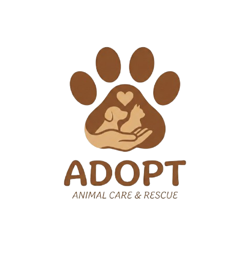
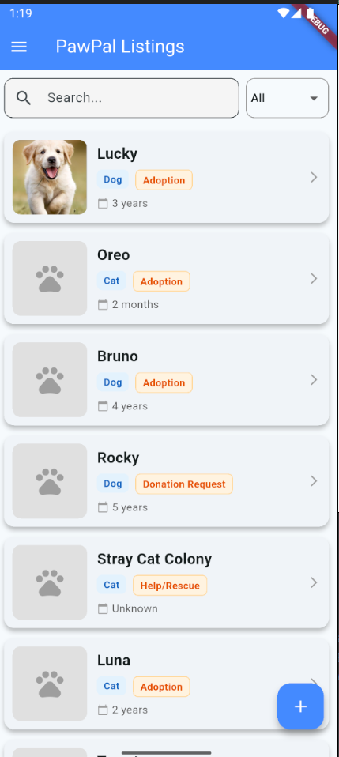
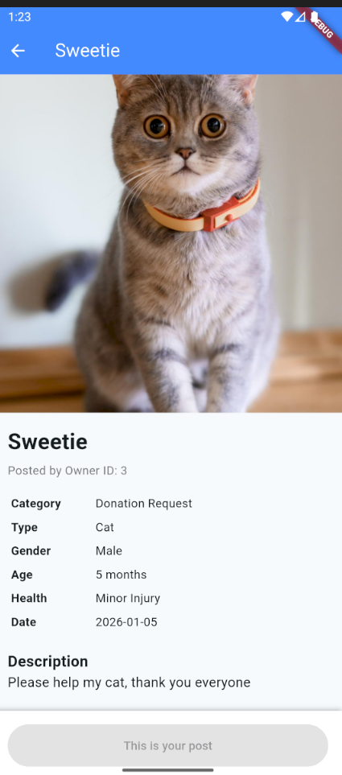
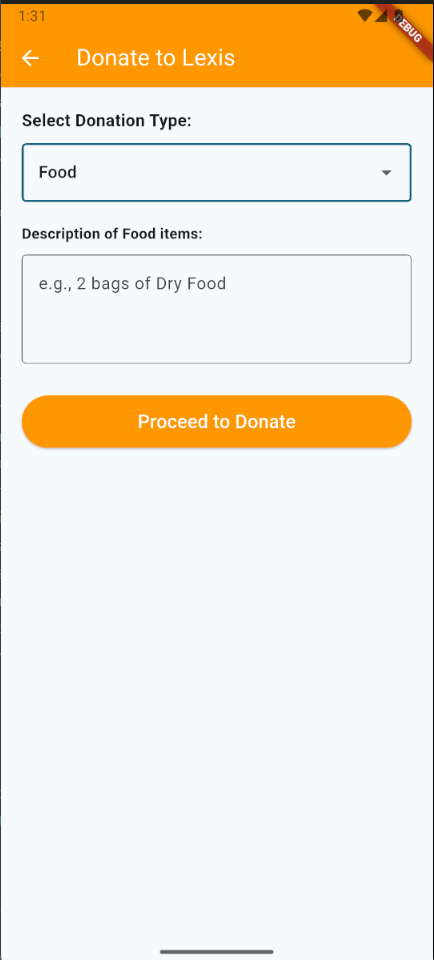

# 🐾 PawPal - Your Furry Friends Finder

<p align="center">
  
</p>

<p align="center">
  <b>Connects pet lovers, adopters, and donors in one seamless platform.</b>
</p>

---

## 📖 Table of Contents
- [🐾 PawPal - Your Furry Friends Finder](#-pawpal---your-furry-friends-finder)
  - [📖 Table of Contents](#-table-of-contents)
  - [📝 About the Project](#-about-the-project)
  - [🏗️ System Architecture](#️-system-architecture)
  - [✨ Key Features](#-key-features)
    - [👤 User System](#-user-system)
    - [🐶 Pet Management](#-pet-management)
    - [💰 Hybrid Donation System](#-hybrid-donation-system)
    - [🎨 UI/UX Design](#-uiux-design)
  - [🛠 Tech Stack](#-tech-stack)
  - [📱 Screenshots](#-screenshots)
  - [🚀 Installation & Setup](#-installation--setup)
    - [Prerequisites](#prerequisites)
    - [1. Server Setup (Backend)](#1-server-setup-backend)
    - [2. App Setup (Frontend)](#2-app-setup-frontend)
  - [📦 Dependencies (Flutter Packages)](#-dependencies-flutter-packages)
  - [🔌 API Usage](#-api-usage)
  - [📂 Project Structure](#-project-structure)

---

## 📝 About the Project

**PawPal** is a hybrid mobile application designed to facilitate pet adoption, rescue missions, and donations. It solves the problem of disconnected pet communities by providing a centralized platform where users can:
1.  **Adopt** pets looking for a home.
2.  **Donate** money (via Billplz) or supplies (Food/Medical) to help pets.
3.  **Rescue** pets in emergency situations.

The app features a robust backend hosted on a live server for managing transactions and a user-friendly frontend built with Flutter.

## 🏗️ System Architecture

The system follows a standard **Client-Server Architecture**:

1.  **Client (Flutter App):** Handles the UI and user input.
2.  **API Layer (PHP):** Processes requests (GET/POST) and handles logic (e.g., verifying payments).
3.  **Database (MySQL):** Stores persistent data like user credentials and pet listings.
4.  **External Services:** * **Billplz:** Handles secure monetary transactions.
    * **Jom Hosting:** Provides live hosting environment.

**Data Flow:**
`Flutter App` <--> `HTTP Request (JSON)` <--> `PHP Scripts` <--> `MySQL Database`

---

## ✨ Key Features

### 👤 User System
* **Secure Authentication:** User Registration and Login with encrypted passwords.
* **Auto-Login:** Splash screen with automated token/session checks.
* **Profile Management:** Update personal details and profile pictures (with cache-busting real-time updates).

### 🐶 Pet Management
* **Add New Pets:** Users can upload pet details including multiple images.
* **My Pets:** Manage your own listings (Delete pets).
* **Interactive Details:** View pet images in a swipeable gallery (`PageView`).
* **Owner Validation:** Users cannot adopt or donate to their own pets (Smart Logic).

### 💰 Hybrid Donation System
* **Monetary Donations:** Integrated with **Billplz Payment Gateway** for secure transactions.
* **Item Donations:** Specialized tracking for "Food" and "Medical" donations (bypasses payment gateway for direct logging).
* **Receipt Generation:** Auto-generated digital receipts for all successful transactions.

### 🎨 UI/UX Design
* **Animated Splash Screen:** Smooth fade-in animations on startup.
* **Custom Navigation:** Side drawer with dynamic user data.
* **Responsive Layouts:** Optimized for different screen sizes.

---

## 🛠 Tech Stack

| Component | Technology | Description |
| :--- | :--- | :--- |
| **Frontend** | Flutter (Dart) | Cross-platform mobile UI |
| **Backend** | PHP (Native) | REST API for data handling |
| **Database** | MySQL (MariaDB) | Relational database for Users, Pets, Donations |
| **Payment** | Billplz API | Sandbox environment for payment processing |
| **Hosting** | Jom Hosting | Live web server (Apache/LiteSpeed) |

---

## 📱 Screenshots

| Home Page | Pet Details | Donation Page | Payment Success |
|:---:|:---:|:---:|:---:|
|  |  |  |  |

---

## 🚀 Installation & Setup

### Prerequisites
* **Flutter SDK** installed on your machine.
* **Jom Hosting Account** (or any standard cPanel hosting).
* **FTP Client** (like FileZilla) or access to File Manager.

### 1. Server Setup (Backend)
1.  **Upload Files:**
    * Upload the `pawpal` folder to your hosting's `public_html` directory via File Manager or FTP.
    * *Path example: `/public_html/pawpal/server/`*
2.  **Database Configuration:**
    * Log in to your Hosting Control Panel (cPanel/DirectAdmin).
    * Create a new MySQL Database (e.g., `yourname_pawpal_db`).
    * Import the provided `pawpal_db.sql` file via **phpMyAdmin**.
3.  **Connect Script:**
    * Open `server/dbconnect.php` on the server.
    * Update the `$servername`, `$username`, `$password`, and `$dbname` with your live hosting credentials.

### 2. App Setup (Frontend)
1.  Open the project in **VS Code**.
2.  Run `flutter pub get` to install dependencies.
3.  **Configure API Endpoint:**
    * Open `lib/myconfig.dart`.
    * Update the `baseUrl` to point to your live domain:
    ```dart
    // Use your actual domain name
    static const String baseUrl = "[https://yourdomain.com](https://yourdomain.com)"; 
    ```
4.  Run the app:
    ```bash
    flutter run
    ```
---

## 📦 Dependencies (Flutter Packages)

This project relies on the following packages:

* [`http`](https://pub.dev/packages/http): For making API calls to the PHP server.
* [`shared_preferences`](https://pub.dev/packages/shared_preferences): For storing user sessions (Auto-Login).
* [`intl`](https://pub.dev/packages/intl): For date formatting.
* [`webview_flutter`](https://pub.dev/packages/webview_flutter): For displaying the Billplz payment page.
* [`cached_network_image`](https://pub.dev/packages/cached_network_image): For efficient image loading (Optional).

---
## 🔌 API Usage

The Flutter frontend communicates with the backend via RESTful API calls. Below are the primary endpoints handling data exchange:

| Method | Endpoint | Description | Parameters (Body/Query) |
| :--- | :--- | :--- | :--- |
| **POST** | `/api/register_user.php` | Registers a new user | `name`, `email`, `phone`, `password` |
| **POST** | `/api/login_user.php` | Authenticates user | `email`, `password` |
| **GET** | `/api/load_pets.php` | Fetches list of all pets | *None* |
| **POST** | `/api/insert_pet.php` | Uploads a new pet listing | `userid`, `name`, `type`, `price`, `desc`, `images` (base64) |
| **POST** | `/api/submit_donation.php` | Processes donation logic | `userid`, `petid`, `amount`, `type` (Food/Money/Medical) |
| **POST** | `/api/payment_success.php` | Validates transaction success | `billplz_id`, `billplz_paid`, `userid` |
  
---

## 📂 Project Structure

```text
lib/
├── main.dart            # Entry point
├── myconfig.dart        # Server configuration
├── models/              # Data models (User, Pet)
├── views/
│   ├── loginPage.dart   # Login screen
│   ├── registerPage.dart# Registration screen
│   ├── main_page.dart   # Home dashboard
│   ├── PetDetailsPage.dart # Pet info & actions
│   ├── DonationPage.dart # Donation form logic
│   ├── payment_page.dart # Billplz WebView
│   └── ...
